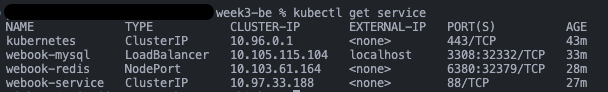
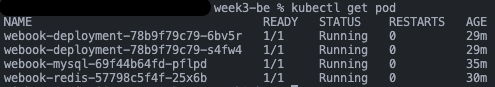
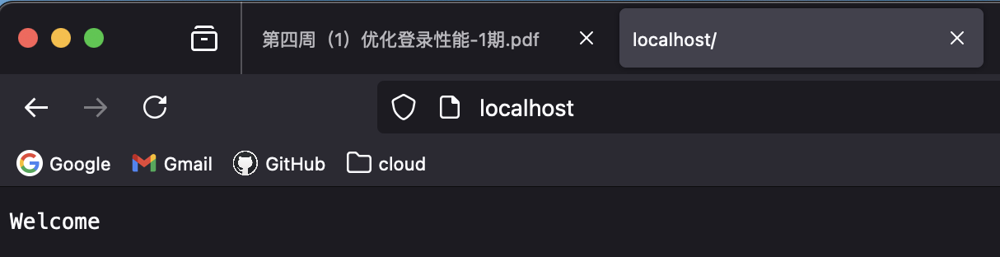

# Week3 HW

## Configuration Files

### webook port 8081

```yaml
apiVersion: v1
kind: Service
metadata:
  name: webook-service
spec:
  type: ClusterIP
  selector:
    app: webook-service
  ports:
    - protocol: TCP
      port: 88
      targetPort: 8081
```

### webook 2 pods

````yaml
apiVersion: apps/v1
kind: Deployment
metadata:
  name: webook-deployment
spec:
  replicas: 2
  selector:
    matchLabels:
      app: webook-service
  template:
    metadata:
      name: webook-service
      labels:
        app: webook-service
    spec:
      containers:
        - name: webook-service
          image: fzy/webook:v0.0.1
          ports:
            - containerPort: 8081
````

### Redis cluster inner port 6380

```yaml
apiVersion: v1
kind: Service
metadata:
  name: webook-redis
spec:
  selector:
    app: webook-redis
  ports:
    - protocol: TCP
#      k8s 内部访问接口
      port: 6380
#      外部访问端口，[30000, 32767]
      nodePort: 32379
      targetPort: 6379
  type: NodePort
```

### MySQL port 3308

```yaml
apiVersion: v1
kind: Service
metadata:
  name: webook-mysql
spec:
  type: LoadBalancer
  selector:
    app: webook-mysql
  ports:
    - name: mysql
      protocol: TCP
      port: 3308
      targetPort: 3306
```

## kubectl

### service



### pod



### request


